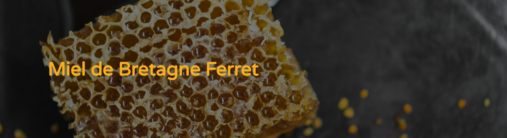
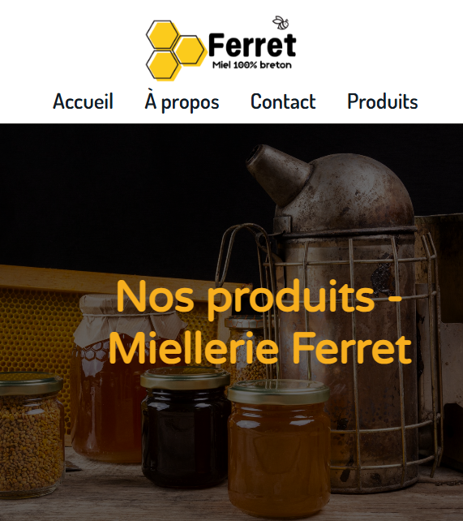
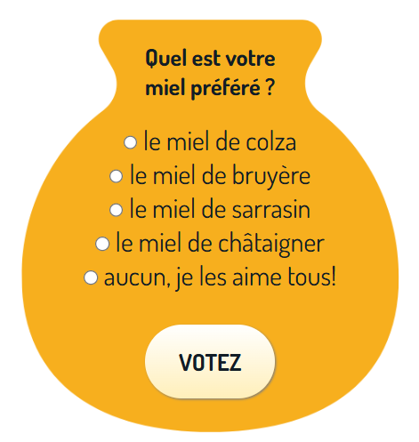
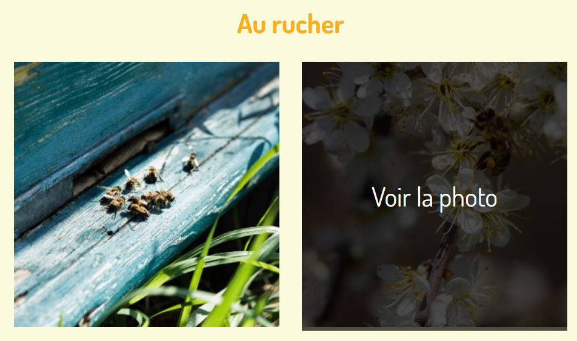
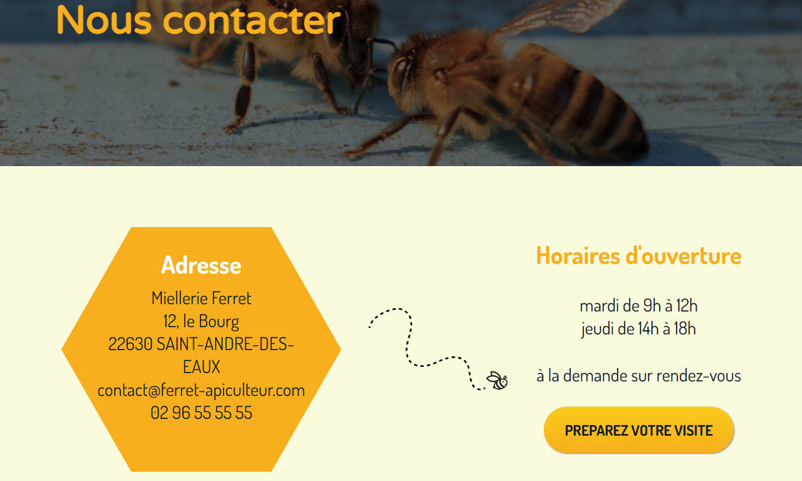
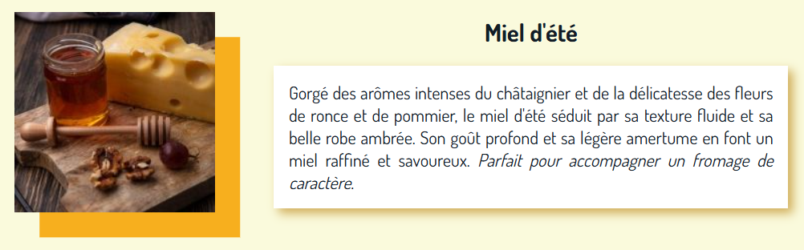

# Miel de Bretagne Ferret

Un site vitrine responsive pour découvrir les produits et valoriser le travail d’un apiculteur fictif situé en Bretagne.  
🔗 <a href="https://MathildeGuedon.github.io/Miellerie-Ferret" target="_blank" rel="noopener noreferrer">Voir le site en ligne</a>

## Aperçu visuel

## À propos

Ce projet a été réalisé dans un cadre d’auto-formation au développement front-end. Tous les contenus (textes, images, produits) sont fictifs et à vocation pédagogique uniquement.

## Fonctionnalités

- **Design responsive** : Vivez une expérience fluide quel que soit votre support : mobile, tablette ou ordinateur.
- **Sondage mensuel** : Engagez les visiteurs de manière ludique.
- **Carte Google Maps intégrée** : Facilitez la localisation de la miellerie.
- **Formulaire de contact dynamique** : Envoyez un message sans rechargement de la page.

## Installation

Clonez le repository puis lancez le projet en double-cliquant sur le fichier index.html.

## Technologies utilisées
- HTML5, CSS3
- JavaScript vanilla
- Intégration Google Maps
- Google Fonts 
- Illustrations : Freepik (mentionnées dans les crédits)

## Objectifs pédagogiques

Ce projet m’a permis de :
- Concevoir une **architecture** de site simple, avec des liens internes et externes.
- Maximiser **l'accessibilité** du site (textes alternatifs des images, Placeholders du formulaire).
- Approfondir mes compétences en **HTML/CSS modernes** (Grid et Flexbox, Media Queries, Favicon).
- Mettre en œuvre du **JavaScript vanilla** pour l’interactivité sans frameworks.
- Gérer les **événements utilisateur**, la validation de formulaire, et la manipulation du DOM.
- Fluidifier **l'expérience utilisateur** (effet au survol des liens, boutons d'appel à l'action, formes et couleurs cohérentes avec le thème)
- Appréhender le langage **Markdown** avec la rédaction du fichier README.md.

## Captures d'écran

### Navigation mobile

### Sondage engageant

### Effet au survol des liens

### Esthétique du thème et CTA

### Effet étiquette

## Contact

Mathilde Guédon - mathilde2.guedon@hotmail.fr - 
<a href="https://www.linkedin.com/in/mathilde-guédon-a08a08369" target="_blank" rel="noopener noreferrer">LinkedIn</a>
